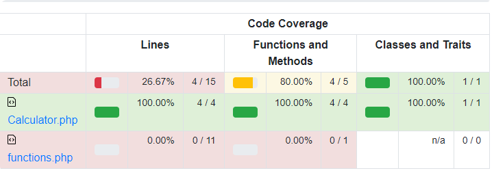

# PHP Unit - Les tests unitaires

[toc]
<!-- TOC -->
* [PHP Unit - Les tests unitaires](#php-unit---les-tests-unitaires)
* [Pré-requis](#pré-requis)
* [Clone du projet](#clone-du-projet)
  * [Installation de PHPUnit](#installation-de-phpunit)
  * [Installation des dépendances](#installation-des-dépendances)
* [Lancer les tests](#lancer-les-tests)
* [Exercice 1](#exercice-1)
  * [Créer une classe `Calculator`](#créer-une-classe-calculator)
  * [Créer les tests](#créer-les-tests)
  * [Exemple de test](#exemple-de-test)
  * [Exécuter les tests](#exécuter-les-tests)
  * [](#)
* [Exercice 2](#exercice-2)
  * [Créer une classe `Person`](#créer-une-classe-person)
  * [Créer les tests](#créer-les-tests-1)
  * [Exemple de test](#exemple-de-test-1)
* [](#-1)
<!-- TOC -->

v0.1

---

# Pré-requis

Dans votre WSL, vous devez avoir installé PHP, git et Composer.

---

# Clone du projet

```bash
git clone git@github.com:LiliwoL/Test-PHPUnit.git
cd Test-PHPUnit
```

> Vous devrez vous placer à la racine du projet.

---

## Installation de PHPUnit

```bash
composer require --dev phpunit/phpunit
```

## Installation des dépendances

```bash
composer update
```

> Il peut être nécessaire d'ajouter les dépendances nécessaires à votre projet.
```bash
sudo apt install php-mbstring
``` 

---

# Démonstration : Lancer les tests

Ouvrez à la fois le fichier `src/functions.php` et le fichier `tests/PasswordTest.php`.

```bash
./vendor/bin/phpunit --color --testdox tests/
```

Les paramètres `--color` et `--testdox` sont optionnels.

> --color: permet d'afficher les résultats des tests en couleur
> --testdox: permet d'afficher les résultats des tests sous forme de liste

---

## Explications

Dans le fichier `src/functions.php`, vous trouverez une fonction `passwordIsValid`.
Dans le fichier `tests/PasswordTest.php`, vous trouverez les tests unitaires correspondants.

> Comment se nomme la classe dans le fichier `PasswordTest.php` ?
> De quelle classe hérite cette classe ?
> Comment se nomme la méthode de test dans la classe `PasswordTest` ?

---

# Exercice 1

## Créer une classe `Calculator`

Créer une classe `Calculator` dans le fichier `src/Calculator.php`.

Cette classe doit comprendre les méthodes suivantes :
- addition
- soustraction
- division
- multiplication

---

## Créer les tests

Créer les tests unitaires pour la classe `Calculator` dans le fichier `tests/CalculatorTest.php`.

Vous devez créer un test pour chaque méthode de la classe `Calculator`.
- testAddition, testSoustraction, testDivision, testMultiplication


## Exemple de test

```php
public function testAddition()
{
    $calculator = new Calculator();
    $result = $calculator->addition(1, 2);
    $this->assertEquals(3, $result);
}
```

---

## Exécuter les tests

```bash
./vendor/bin/phpunit --color --testdox tests/CalculatorTest.php
```

> Tous les tests doivent passer.
   
---

# Exercice 2

## Créer une classe `Person`

Créer une classe `Person` dans le fichier `src/Person.php`.

Cette classe doit comprendre les propriétés suivantes :
- nom
- prénom
- âge
- sexe
- adresse
- code postal
- ville
- pays
- téléphone
- email
- date de naissance

Cette classe doit contenir les getters et les setters correspondants.

---

## Créer les tests

Créer les tests unitaires pour la classe `Person` dans le fichier `tests/PersonTest.php`.

## Exemple de test

```php
public function testGetFullName()
{
    $person = new Person();
    $person->setNom('Doe');
    $person->setPrenom('John');
    $result = $person->getFullName();
    $this->assertEquals('John Doe', $result);
}
```

---

# Exercice 3 - Définition du taux de couverture de code

## Configuration de PHPUnit

On va générer la configuration de PHPUnit avec la commande :

```bash
./vendor/bin/phpunit --generate-configuration
```

À chacune des questions, vous pouvez répondre en laissant les valeurs par défaut.

Le fichier généré va ressembler à ceci:
```xml
<?xml version="1.0" encoding="UTF-8"?>
<phpunit backupGlobals="false"
         backupStaticAttributes="false"
         bootstrap="vendor/autoload.php"
         colors="true"
         convertErrorsToExceptions="true"
         convertNoticesToExceptions="true"
         convertWarningsToExceptions="true"
         processIsolation="false"
         stopOnFailure="false"
         syntaxCheck="false"
         verbose="true">
    <testsuites>
        <testsuite name="Application Test Suite">
            <directory>tests/</directory>
        </testsuite>
    </testsuites>
    <filter>
        <whitelist processUncoveredFilesFromWhitelist="true">
            <directory suffix=".php">src/</directory>
        </whitelist>
    </filter>
</phpunit>
```

---

## Dépendances pour le code coverage

Pour effectuer un code-coverage, il faut installer les dépendances nécessaires.
Au choix, Xdebug, PHPDBG ou PCOV.

```bash
sudo apt install php-pcov
```

---

## Ajout des annotations dans nos tests

Pour générer un rapport de code coverage, il faut ajouter des **annotations** dans nos tests.

```php
/**
 * @covers Calculator::addition
 */
public function testAddition()
{
    ...
}
``` 

Le fait d'ajouter cette **annotation** permet de dire à PHPUnit que le test `testAddition` couvre la méthode `addition` de la classe `Calculator`.

> Ajouter les annotations dans les méthodes de tests de la classe `CalculatorTest` et de la classe `PersonTest`.

---

## Lancer les tests avec le code coverage

Les tests du dossier **tests** vont être lancés, et un rapport sera généré dans le dossier **coverage**.

```bash
./vendor/bin/phpunit --color --testdox --coverage-html coverage tests/
```

Rendez-vous dans le dossier **coverage** pour consulter le rapport.




> Vous devez avoir un taux de couverture de 100% pour les classes `Calculator` et `Person`.